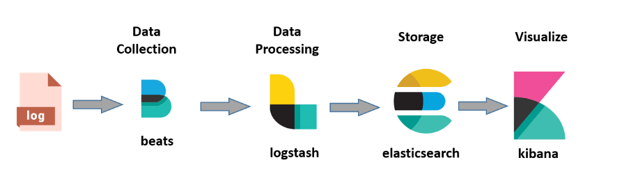

# ELK-Stack Installation and Configurations

Here is the general and broader level concept of elk-stack with filebeat



Logs ----~~**~~filebeat~~**~~----->  **Logstash** ---> **Elasticsearch** ---> **kibana**

- **Logstash**: Collect logs and events data. It even parses and transforms data
- **ElasticSearch**: The transformed data from Logstash is Store, Search, and indexed.
- **Kibana**: Kibana uses Elasticsearch DB to Explore, Visualize, and Share

And at the end, using the <elkstack-public-ip>:<kibana-port> we can see via kibana inside our browser. And we can also create dashboards of our own choices, for that we need our desired components to be parsed perfectly at logstash level.

Acttually logstash.conf file has three portions/sections :

1. Input : defines the address to which our logstash is listening to receive logs
2. Filter : here we can apply our desired filters to parse data according to our requirements
3. Output : It directs logstash where to forward this parsed data, it is generally directed to elasticsearch, so we give path for elasticsearch here.

Here is the most simple way of setting up elk in a dockerized environment

## Pre-requisities:

- Linux server with docker and docker compose installed in it.

## Installing and Configuring ELK

Here are steps: 

1. Clone this repo in you server https://github.com/deviantony/docker-elk
2. change the port mapping (if needed)
3. change the passwords from `.env` file present inside this repo
4. run `docker compose up --build -d`
5. rest we can moniter and fix anythings (if happens) just like we play with docker containers.

## Installing and Configuring filebeat

Actually we are using filebeat here to ship logs to logstash

Now is the turn to configure filebeat on a remote server (it can also be the same local server too)

1. download rpm in that remote server --> `wget https://artifacts.elastic.co/downloads/beats/filebeat/filebeat-8.15.1-x86_64.rpm`
2. now install this package `yum install filebeat-8.15.1-x86_64.rpm -y`
3. you will find these or similar files/directories inside `/etc/filebeat`
  - fields.yml  
  - filebeat.reference.yml  
  - filebeat.yml  
  - modules.d
4. we will define which logs we want to ship from isnide this filebeat.yml file

Here is the simplified example of how this filebeat.yml should look like:

```
filebeat.inputs:
- type: log
  enabled: true
  paths:
    - /var/log/mail.log

output.logstash:
  hosts: ["<elk-server-ip>:<logstash-port>"]

# Additional logging configuration to capture logs in a file
logging.level: debug
logging.selectors: ["*"]

# Ensure logging output goes to a file
logging.to_files: true
logging.files:
  path: /var/log/filebeat
  name: filebeat
  keepfiles: 7
  permissions: 0644
  rotateeverybytes: 10485760 # 10 MB
```

