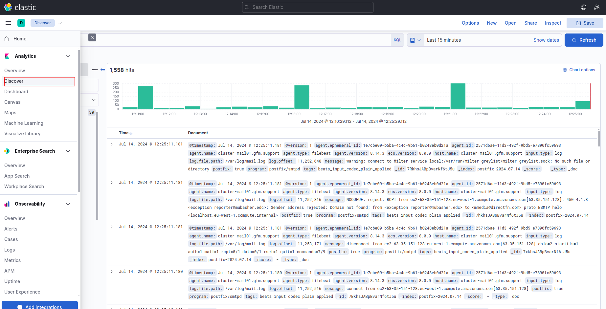

# ELK Stack Setup Using Docker

Scenario and Requirement: We actually had a mail server (server "A") where we were getting logs from x,y,z sources at "/var/log/mail.log", and requirement was to make a dedicated server (server "B") and configure elk over it. So that we can have graphical UI of logs that are pooling at server "A".

Overview of Task:

- Created a dedicated server (server "B")
    - 2 virtual cores
    - 4 gb memory
    - 50 gb disk
- Installed docker engine and docker compose on server "B"
- Using docker compose file, created containers for each of the elk component.
- Installed and configured filebeat on server "A" to send logs to logstash container on "B"
- Using browser, accessed kibana to view logs.

Here are detailed steps to configure all above settings:

 Server B and Filebeat Configuration on Server A

## Server B: Setup ELK Stack Using Docker

### 1. Install Docker and Docker Compose

To begin, update your package index and install Docker and Docker Compose:

```
sudo apt-get update
sudo apt-get install -y docker.io docker-compose
sudo systemctl start docker
sudo systemctl enable docker
```

### 2. Create a Docker Compose File for ELK Stack

- `mkdir elk_stack`
- `cd elk_stack`
- `nano docker-compose.yml` <--- create a docker compose file
```
version: '3.7'

services:
  elasticsearch:
    image: docker.elastic.co/elasticsearch/elasticsearch:7.17.0
    container_name: elasticsearch
    environment:
      - discovery.type=single-node
      - bootstrap.memory_lock=true
      - "ES_JAVA_OPTS=-Xms512m -Xmx512m"
    ulimits:
      memlock:
        soft: -1
        hard: -1
    ports:
      - "9200:9200"
    volumes:
      - es_data:/usr/share/elasticsearch/data

  logstash:
    image: docker.elastic.co/logstash/logstash:7.17.0
    container_name: logstash
    volumes:
      - ./logstash.conf:/usr/share/logstash/pipeline/logstash.conf
    ports:
      - "5044:5044"

  kibana:
    image: docker.elastic.co/kibana/kibana:7.17.0
    container_name: kibana
    ports:
      - "5601:5601"
    environment:
      ELASTICSEARCH_URL: http://elasticsearch:9200

volumes:
  es_data:
    driver: local

```

### 3. Create Logstash Configuration

- `nano logstash.conf` <--- Create Logstash Configuration
```
input {
  beats {
    port => 5044
  }
}

filter {
  if [postfix] {
    grok {
      match => { "message" => "%{SYSLOGTIMESTAMP} %{SYSLOGHOST} %{DATA:program}(?:\[%{POSINT}\])?: %{GREEDYDATA:message}" }
      overwrite => "message"
    }
  }
}

output {
  elasticsearch {
    hosts => ["http://elasticsearch:9200"]
    index => "postfix-%{+YYYY.MM.dd}"
  }
}

```

### 4. Run Docker Compose

`sudo docker-compose up -d`

## Server A: Install Filebeat and Configure

### 1. Install Filebeat

Download and install the Filebeat package:

```
curl -L -O https://artifacts.elastic.co/downloads/beats/filebeat/filebeat-7.17.0-amd64.deb
sudo dpkg -i filebeat-7.17.0-amd64.deb
```

### 2. Configure Filebeat

Edit the `filebeat.yml` file, located in "/etc/filebeat/", to include the following configuration:

```
filebeat.inputs:
- type: log
  paths:
    - /var/log/mail.log*
  exclude_files: [".gz$"]
  fields:
    postfix: true
  fields_under_root: true

output.logstash:
  hosts: ["<Server_B_IP>:5044"]
```

Replace <Server_B_IP> with the IP address of Server B.

### 3. Enable and Start Filebeat

To enable and start the Filebeat service, run:

```
sudo filebeat modules enable system
sudo systemctl enable filebeat
sudo systemctl start filebeat
```

## Access Kibana Dashboards

- Open your browser and navigate to http://<server_B_ip>:5601
- Go to "Discovery" from the left panel > add any inventory (select any format you want to choose, from those appearing in right of the scree inside discovery)
- Next time, when you  will click on discovery you will get the logs as below:

